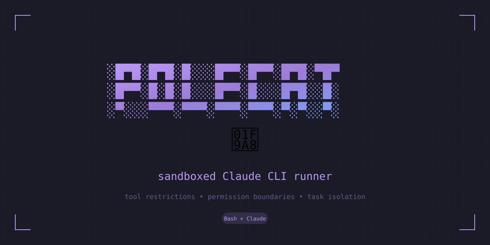

<p align="center">
  
</p>

<p align="center">
  <em>Tool restrictions • Permission boundaries • Task isolation</em>
</p>

<p align="center">
  
  
  
</p>

---

Sandboxed Claude CLI runner with tool restrictions and retry logic.

Polecats can read/write within their working directory but cannot escape it, use destructive commands, or execute arbitrary code against the OS.

> **Why "polecat"?** A polecat is a small, nimble mustelid — and this tool wraps Claude CLI like a ferret in a burrow. Contained but capable.

## Installation

```bash
# Already symlinked to ~/.local/bin/polecat
# Or manually:
ln -sf ~/code/polecat/polecat ~/.local/bin/polecat
```

## Usage

```bash
# Basic task
polecat "analyze this codebase"

# Specify working directory
polecat -w ./my-project "fix the bug in main.py"

# Read task from file
polecat -f task.md

# JSON output (for parsing)
polecat -j "generate a summary"

# Multiple retries
polecat -m 5 -d 3 "complex task that might fail"

# Verbose mode
polecat -v "debug this issue"
```

## Tool Restrictions

### Allowed (within workdir)
- `Read` — read any file
- `Write(./**)` — write within workdir only
- `Edit(./**)` — edit within workdir only
- `Glob`, `Grep`, `LS` — file discovery
- Safe bash: `cat`, `ls`, `head`, `tail`, `wc`, `grep`, `find`, `echo`, `pwd`, `date`

### Denied
- `rm`, `sudo`, `curl`, `wget` — destructive/network
- `chmod`, `chown` — permission changes
- `mv`, `cp` — file operations (use Write instead)
- `ssh`, `scp`, `rsync` — remote access
- `Write(../*)`, `Write(/*)` — escape workdir

## Exit Codes

- `0` — Success
- `1` — All retries exhausted
- Non-zero from Claude CLI — propagated

## Environment Variables

- `POLECAT_MAX_TRIES` — Override default max retries (3)
- `POLECAT_RETRY_DELAY` — Override delay between retries (2s)

## Implementation Notes

Key discoveries during development:

1. **PTY Required**: Claude CLI requires a TTY even in `-p` (print) mode. Solved with `script -q /dev/null -c "..."` wrapper.

2. **Argument Parsing**: Must use `--` separator before the prompt argument to avoid confusion with tool flags containing special characters.

3. **Bash Arithmetic Bug**: `((attempt++))` returns exit code 1 when incrementing from 0 (bash treats 0 as falsy), which triggers `set -e`. Solved with `|| true`.

## Contributing

Issues and PRs welcome. The main script is `polecat` — it's a single bash file with no dependencies beyond Claude CLI and standard unix tools.

## License

MIT — see [LICENSE](LICENSE)
